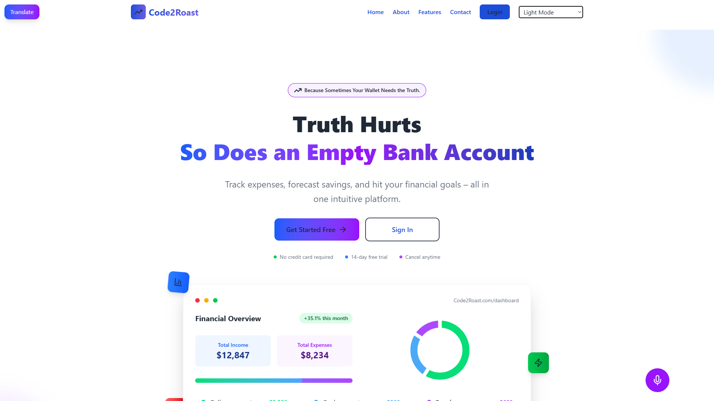
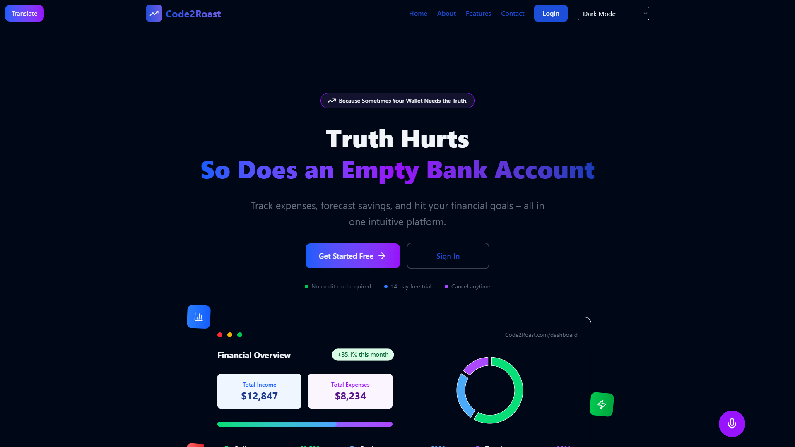
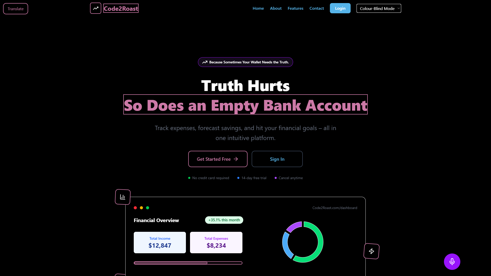
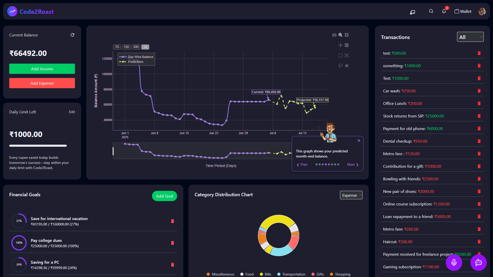
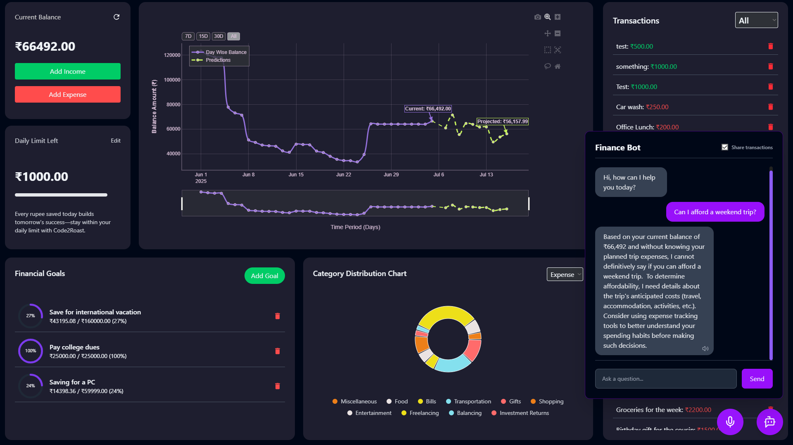

# 💸 Call2Code

## 🤖 Because Sometimes Your Wallet Needs the Truth. — Now with Voice, Story, and Accessibility

**Call2Code** is the ultimate Gen Z fintech playground:  
A sleek, interactive **expense tracker**, **AI‑powered forecasting engine**, **automated goal allocator**, and **on‑demand chatbot advisor**—now enhanced with powerful accessibility and storytelling features for hackathons and real-world impact.

---

## 📌 LIVE DEMO + VIDEO

> 🚀 Live Site: [Live link](https://call2roastlive.vercel.app)  
> 🚀 Demo Video: [YouTube Demo](https://www.youtube.com/watch?v=S6Nnzn5M5dc)  
> 🚀 Hackathon Slides: [Google Slides](https://drive.google.com/file/d/1Z9uOV4kCq4NQ5aUEO2UFnHHawQHtTYAE/view?usp=sharing)

### ⚠️ **IMPORTANT NOTE: Run only in Google Chrome!**
Voice navigation and text-to-speech features **only work in Chrome** due to browser support for the Web Speech API.

---

### ❗ FIRST-TIME SETUP INSTRUCTIONS (Required for Chatbot + ML Forecast to Work)

Because our AWS server isn’t SSL-certified, Chrome blocks requests to it.  
👉 Please visit the following link below manually, click **Advanced → Proceed anyway**, then you can close the tabs:

1. `https://51.20.53.130`  

---

## 📸 Screenshots

| Landing Page (Light) | Landing Page (Dark) | Landing Page (Colorblind) |
|----------------------|---------------------|----------------------------|
|  |  |  |

| Dashboard | Chatbot |
|-----------|---------|
|  |  |

---

## 🧠 HACKATHON CHALLENGE FEATURES (2024)

We've added several innovative features focused on **accessibility, UX creativity, and interactivity**:

### 🗣️ Voice Navigation + Accessibility (Hard – 6 pts)
- Control the app by **talking to it** — e.g., “Add a transaction of ₹500” or “Go to Dashboard”.
- Powered by `react-speech-recognition` + command parsing logic.
- Adds inclusive UX for users with disabilities.

### 🔈 Text-to-Speech Content (Hard – 6 pts)
- The Chatbot now **speaks out** replies using `SpeechSynthesisUtterance` (Web Speech API).
- Makes financial guidance more accessible and personal.

### 🎮 Creative 404 Fallback (Easy – 2 pts)
- If the chatbot or forecast fails, users get to **play Pong inside the chatbot window**!
- A humorous fallback for failed API routes.

### 🌚 Dark Mode Support (Easy – 2 pts)
- Supports toggling between Light, Dark, and **Colorblind mode** via dropdown.
- Fully implemented with Tailwind’s `darkMode: "class"`.

### 🔄 Custom Loading States (Easy – 2 pts)
- Fun animations while Chatbot/ML/Goal APIs load.
- Includes typing dots, spinning icons, and subtle motion elements.

### 🌍 Multilingual Support (Medium – 4 pts)
- Google Translate widget enables live translation of the entire landing page.
- Improves accessibility for global users and hackathon judges.

### 📜 Story Mode Walkthrough (Medium – 4 pts)
- A guided **narrator-style onboarding tutorial** walks the user through key features.
- Dynamic position-aware tooltips highlight each dashboard element.
- Powered by Framer Motion + Zustand state tracking.

---

## 🌟 Core Features

- ✅ **Secure Onboarding**  
  Signup/login via JWT, then setup your balance & limit in one go.

- ✅ **Instant Transactions**  
  Real-time “Add Income” / “Add Expense” logging — no page reload.

- ✅ **Daily Budget Tracker**  
  Visual progress bar shows remaining daily limit. Friendly nudges included!

- ✅ **Smart Goal Allocation**  
  Drag-and-drop goals. ML splits your projected surplus automatically.

- ✅ **AI Forecasting Engine**  
  TensorFlow-based LSTM model predicts month-end balance. Wrapped with LangChain & FastAPI.

- ✅ **Category Analytics**  
  Beautiful pie charts categorize your spending.

- ✅ **Integrated AI Chatbot**  
  LLM-powered advisor answers context-aware financial queries.

- ✅ **Responsive, Polished UI**  
  React + TailwindCSS + Framer Motion. Works beautifully across screen sizes.

---

## 🔑 Demo Account

You can explore the full site without signing up:

> **Email:** `nemollytest@team.com`  
> **Password:** `Nemolly#123`

---

## 🛠️ Tech Stack

| Frontend | Backend | AI / ML |
|:--------:|:-------:|:-------:|
|                              |                                 |                                 |

---

## 📌 TODOs / Roadmap

- **Bank Integrations**: Add Plaid or TrueLayer for automatic transaction imports.  
- **Mobile Apps**: Develop native iOS and Android versions with push notifications.  
- **Pro Forecasting**: Implement “what-if” scenario planning and proactive alerts.  
- **Social Features**: Build savings challenges and group goals for community engagement.  
- **Premium Tier**: Finalize subscription flow for advanced analytics and AI coaching.  
- **Security Audits**: Conduct third-party penetration testing and GDPR compliance review.

---

## 🧑‍💻 Team Jalebi Fafda

- **Neeraj** — AI/ML + Backend Developer [@artyish](https://github.com/artyish)  
- **Harshita** — Frontend Developer [@idkdolly](https://github.com/idkdolly)  
---

## ⚡ Special Thanks

- OpenAI (ChatGPT + Whisper)  
- AWS EC2 + HuggingFace  
- FastAPI, LangChain  
- Hackathon mentors & judges 🙏  

---

# Made with ❤️ by Team Nemolly  
